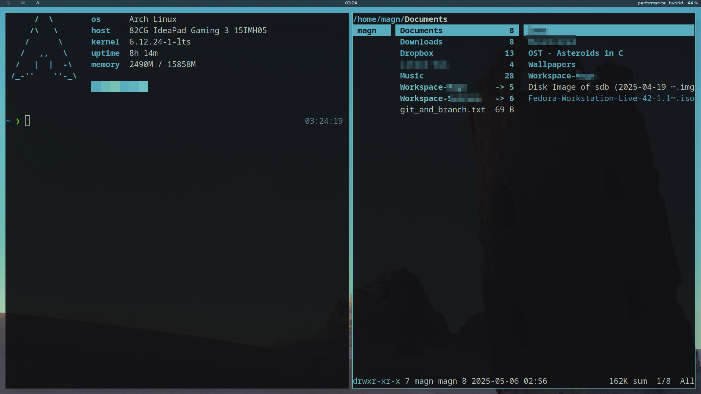

# Kaiser Linux "Distro"
- i3wm setup
- Graphical
- Rofi
- Query/Text-centered

# Considerations
- Using git as Dropbox used to present problems in downloading and distribution.
- This improves distribution, and manual changes can be made via AnyDesk and/or SSH.
